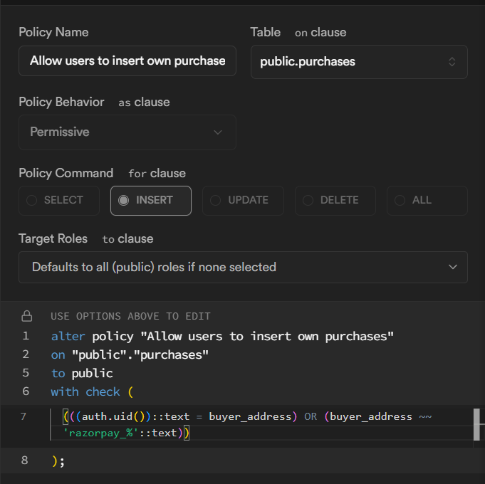

npm i 

add env files 

policy     (((auth.uid())::text = buyer_address) OR (buyer_address ~~ 'razorpay_%'::text))

run in supabase 

CREATE TABLE public.datasets (
  id uuid NOT NULL DEFAULT gen_random_uuid(),
  name text NOT NULL,
  description text,
  price numeric NOT NULL,
  category text,
  tags ARRAY,
  ipfs_hash text NOT NULL,
  file_name text,
  file_size bigint,
  file_type text,
  uploader_address text NOT NULL,
  upload_timestamp timestamp with time zone DEFAULT now(),
  schema_json jsonb,
  preview_json jsonb,
  file_url text,
  downloads integer DEFAULT 0,
  preview_data text,
  preview_image_hash text,
  status text,
  CONSTRAINT datasets_pkey PRIMARY KEY (id)
);

CREATE TABLE public.purchases (
  id uuid NOT NULL DEFAULT gen_random_uuid(),
  dataset_id uuid,
  buyer_address text,
  purchased_at timestamp without time zone DEFAULT now(),
  tx_hash text NOT NULL DEFAULT ''::text,
  confirmed boolean DEFAULT false,
  amount_paid numeric,
  currency character varying,
  payment_method character varying,
  purchase_date timestamp without time zone DEFAULT now(),
  status text DEFAULT 'completed'::text,
  CONSTRAINT purchases_pkey PRIMARY KEY (id),
  CONSTRAINT purchases_dataset_id_fkey FOREIGN KEY (dataset_id) REFERENCES public.datasets(id)
);